# Evaluación T1 CIBERTEC: Arquitectura de Microservicios con Spring Cloud
**Curso:** Desarrollo de Aplicaciones Web II 

**Docente:** Simon Eliad Choque Del Pozo

**Alumno:** Carlos Miguel  Lazo Domínguez

## 📌 Descripción del Proyecto (Caso DentiCore)
El presente proyecto es una prueba de concepto  que implementa una arquitectura basada en microservicios para resolver la validación y agendamiento de citas en un entorno clínico (DentiCore). 

El objetivo principal es demostrar la correcta implementación de los componentes de **Spring Cloud** , específicamente el descubrimiento dinámico de servicios y la comunicación sincrónica declarativa, alejándose de los flujos transaccionales básicos para aplicar reglas de negocio complejas distribuidas.

## 🏗️ Topología del Ecosistema
La solución está compuesta por 3 microservicios integrados:

1. **eureka-server (Puerto 8761):** * Actúa como Service Registry. Permite que los microservicios se localicen entre sí mediante nombres lógicos sin depender de IPs estáticas.
2. **paciente-service (Puerto 8001):** * **Rol:** Proveedor. 
   * **Responsabilidad:** Gestiona el historial clínico, alergias y estado de alta de los pacientes.
3. **cita-service (Puerto 8002):** * **Rol:** Consumidor. 
   * **Responsabilidad:** Recibe solicitudes de agendamiento y utiliza **OpenFeign** para consultar a `paciente-service`. Aplica la lógica de negocio para aprobar o rechazar cirugías en base al estado de riesgo del paciente.

## 🚀 Instrucciones de Despliegue
Para garantizar el correcto funcionamiento del ecosistema, es indispensable ejecutar los proyectos en el siguiente orden estricto:

1. Iniciar `EurekaServerApplication.java`. (Verificar el dashboard en `http://localhost:8761`).
2. Iniciar `PacienteServiceApplication.java`.
3. Iniciar `CitaServiceApplication.java`.
*(Nota: Aguardar unos segundos tras el inicio para que el registro en Eureka se propague correctamente).*

## 🧪 Pruebas de Funcionamiento (Postman)
Se adjunta en este repositorio el archivo exportado `postman_collection.json` para facilitar las pruebas. Los endpoints principales son:

### 1. Obtener Historial (Comunicación Directa)
* **Método:** `GET`
* **Ruta:** `http://localhost:8001/api/pacientes/{id}`
* **Parámetros de prueba:** Existen 3 pacientes simulados en memoria (IDs: `1`, `2`, `3`).

### 2. Agendar Cita y Validar Regla de Negocio (Comunicación Sincrónica Inter-servicio)
* **Método:** `POST`
* **Ruta:** `http://localhost:8002/api/citas/agendar`
* **Parámetros de prueba:** IDs existentes(1,2,3), complejidad de procedimiento (true/false), especialidad y fecha de prueba.
* **Body (JSON):**
```json
    {
        "idPaciente": 2,
        "fecha": "2026-06-15",
        "especialidad": "Cirugia Maxilofacial",
        "esProcedimientoComplejo": true
    }
```
**Lógica Evaluada:** Al lanzar esta petición, el `cita-service` intercepta la solicitud y se comunica sincrónicamente (vía OpenFeign) con el `paciente-service` para consultar el historial clínico. Las reglas de negocio aplicadas son:

- Si el `idPaciente` es 1: La cita será **APROBADA** (Paciente dado de alta y sin riesgos).
- Si el `idPaciente` es 2: La cita será **RECHAZADA** (Regla: Requiere autorización médica previa por riesgo cardiológico).
- Si el `idPaciente` es 3: La cita será **RECHAZADA** (Regla: El paciente tiene un tratamiento actualmente en curso).

## 📸 Evidencias de Ejecución

### 1. Creación de Proyectos (Spring Initializr)
Se evidencia la creación de la arquitectura del proyecto en general, cada proyecto con sus dependencias respectivas.

**Eureka Server**


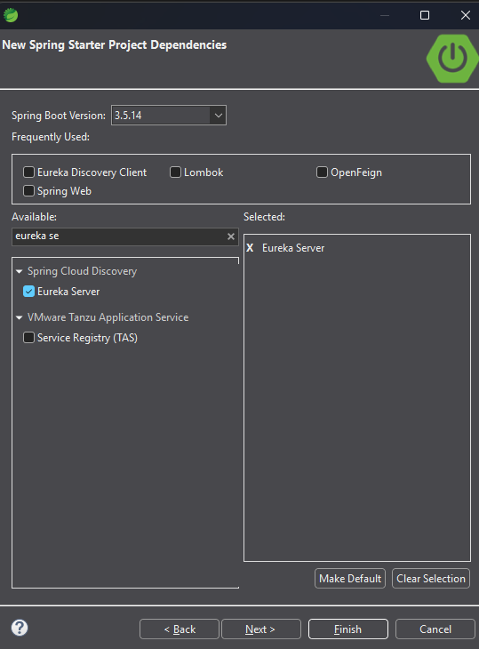

**Paciente Service**

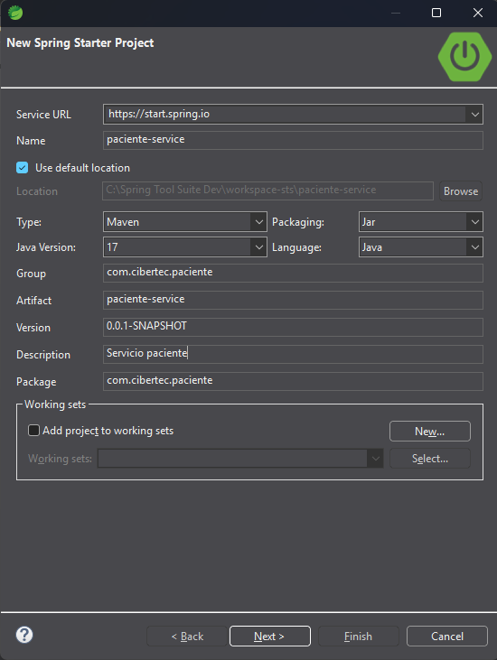

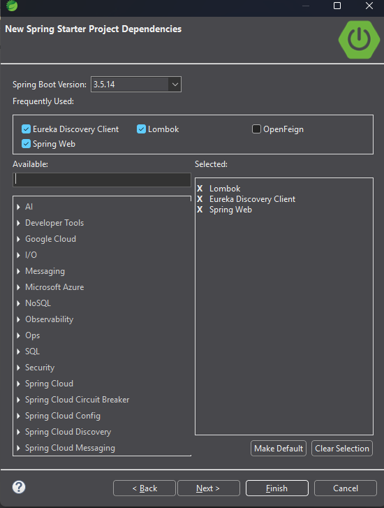

**Cita Service**

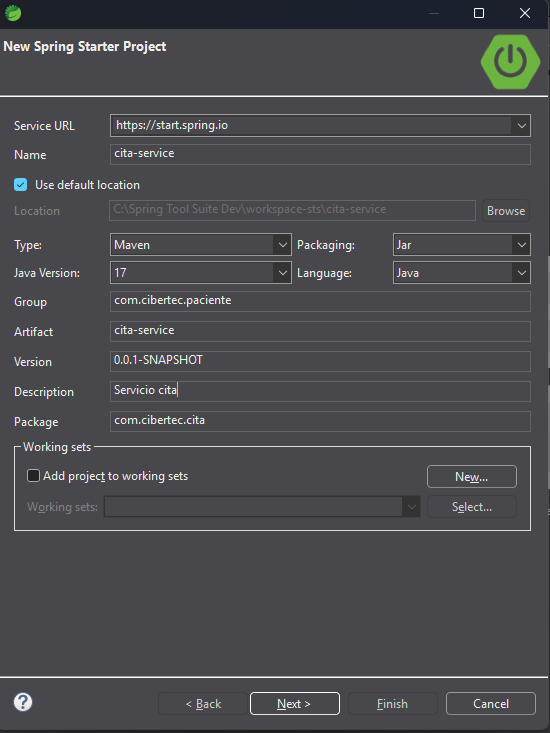

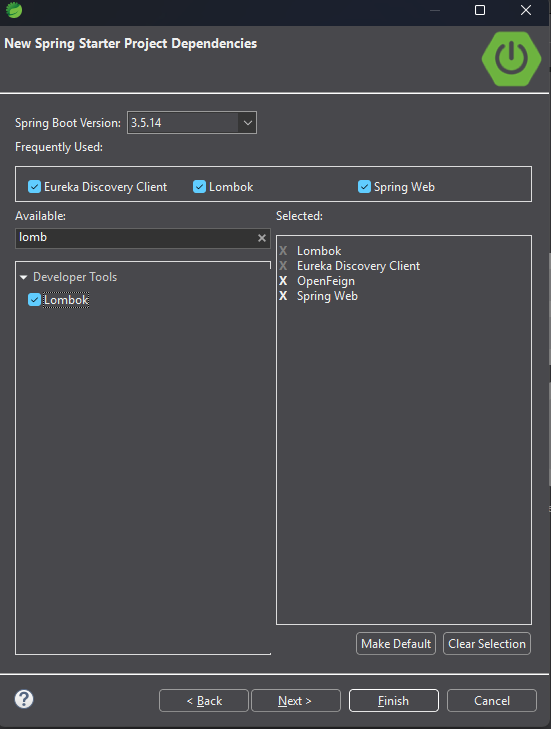

### 2. Entorno de Desarrollo (Spring Boot Dashboard)
Se evidencia la ejecución simultánea e independiente de los tres proyectos en el espacio de trabajo.

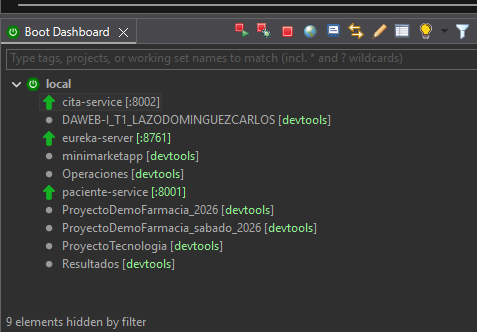

### 3. Registro en Eureka Server
Confirmación de la etapa de descubrimiento dinámico. Los microservicios `CITA-SERVICE` y `PACIENTE-SERVICE` se encuentran registrados y en estado **UP**.

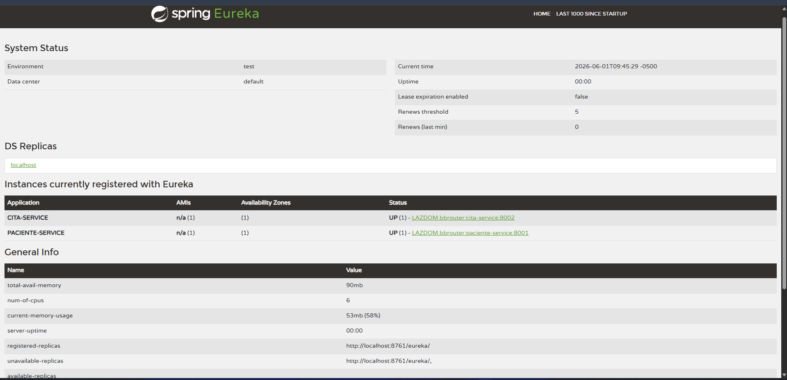

### Pruebas de Comunicación y Lógica de Negocio (POSTMAN)            

### 4. Prueba de Microservicio Proveedor (GET)
Consulta directa y aislada a `paciente-service` para verificar la exposición de los datos clínicos.

-Prueba GET Paciente con ID=1

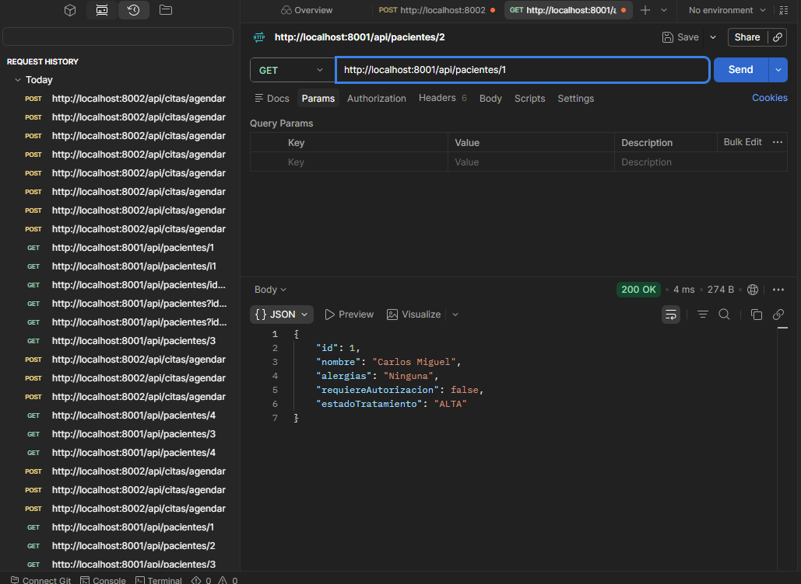

-Prueba GET Paciente con ID=2

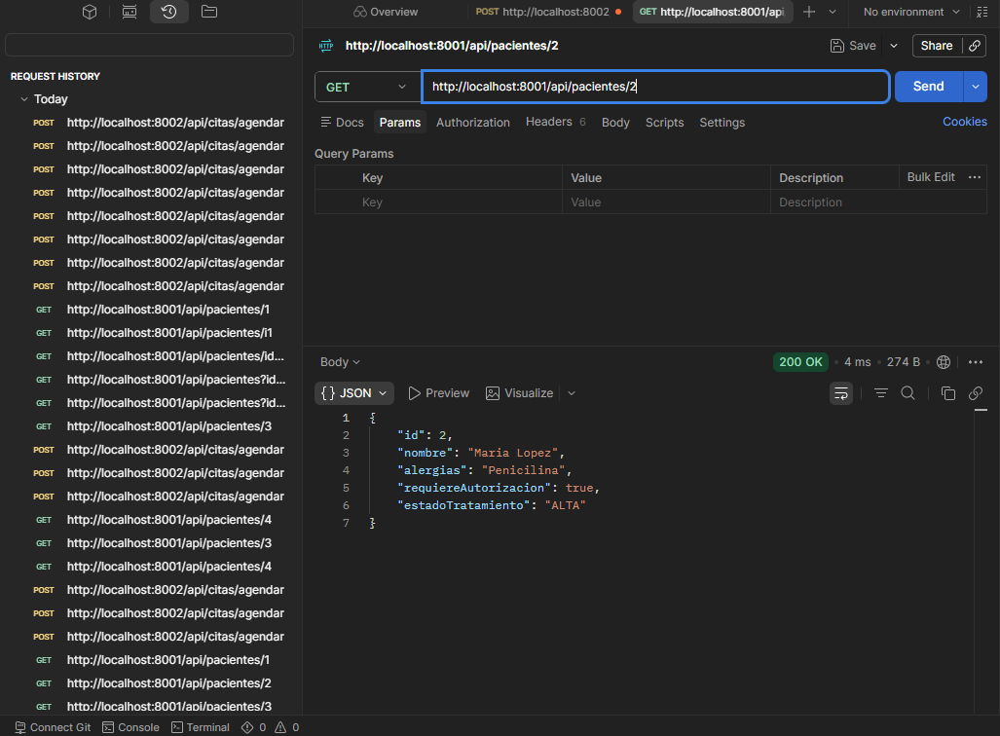

-Prueba GET Paciente con ID=3

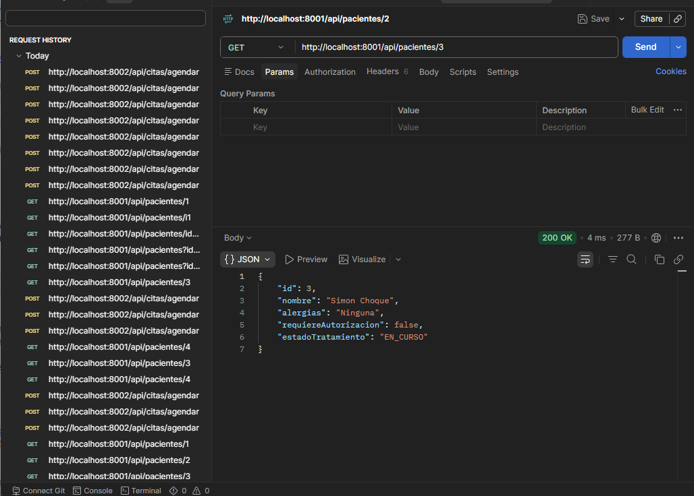

### 5. Pruebas de Integración y Reglas de Negocio (POST vía Feign)

**Caso A: Cita Aprobada (Paciente 1)**
El servicio valida que el paciente está dado de alta y no presenta riesgos.

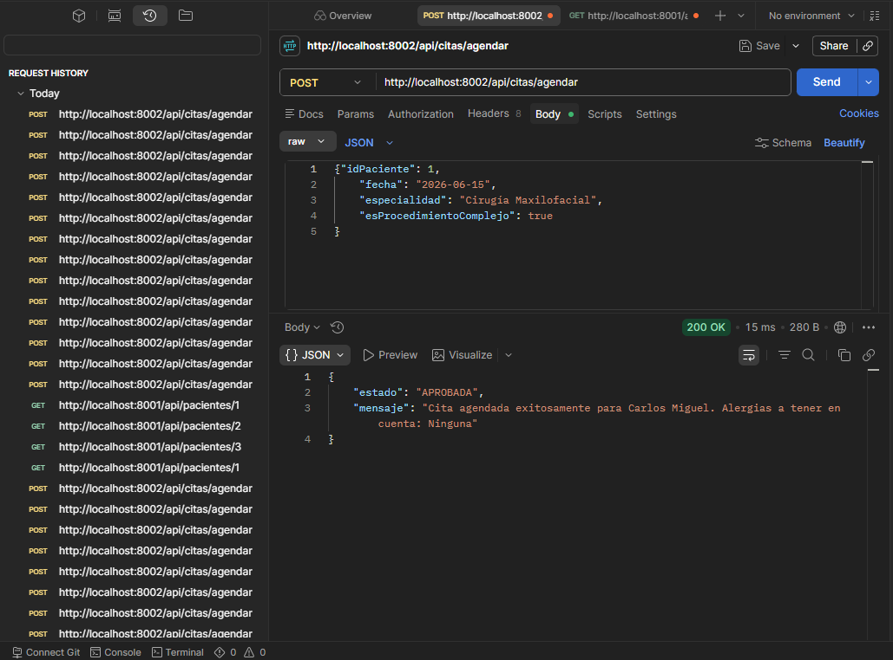

**Caso B: Cita Rechazada por Riesgo (Paciente 2)**
El servicio intercepta la solicitud y la bloquea al detectar que el paciente requiere autorización médica.

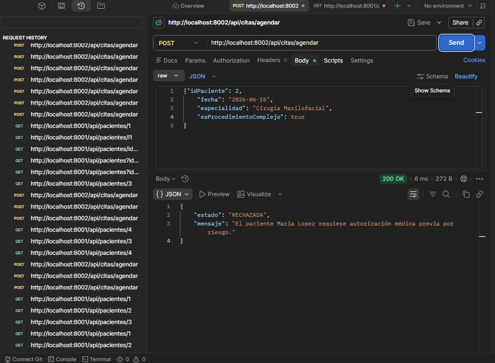

**Caso C: Cita Rechazada por Tratamiento (Paciente 3)**
El servicio bloquea la solicitud al detectar que el paciente mantiene un tratamiento en curso.

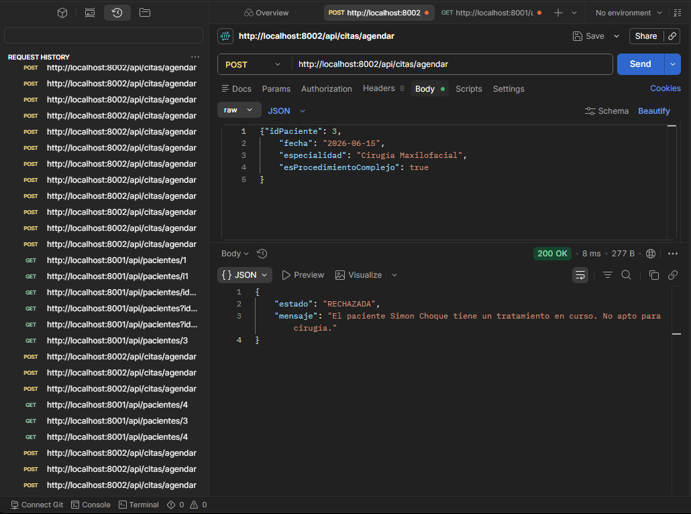
